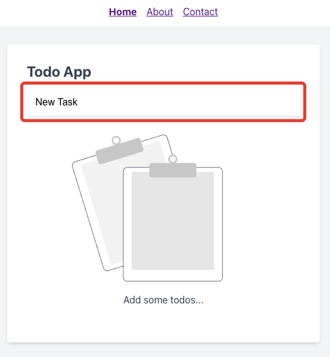

# Создание задачи

Наименование задачи необходимо указать в поле:

И нажать `Enter`.

После создания задача появится в списке ниже:

---

Следующее: [Редактирование задачи](../05-edit-task/README.md)