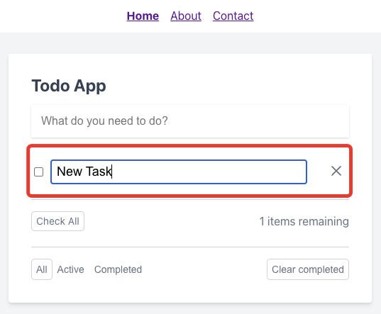

# Редактирование задачи

Для перехода в режим редактирования задачи необходимо совершить двойной клик по её наименованию:

Ввести новое наименование и нажать `Enter` или кликнуть вне поля. Изменения будут сохранены.

Изменения будут сброшены в случае нажатия `Esc` или пустого наименования задачи.

---

Следующее: [Удаление задачи](../06-delete-task/README.md)