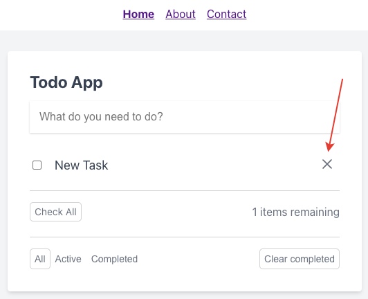

# Удаление задачи

Для удаления задачи необходимо кликнуть по кнопке справа от неё:

После этого задача пропадёт из общего списка.

---

Следующее: [Завершение задачи](../07-complete-task/README.md)