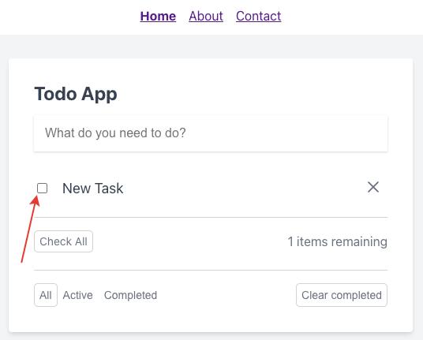
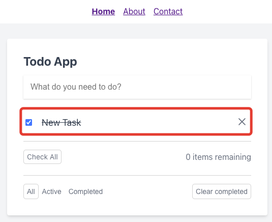

# Завершение задачи

Для завершения задачи необходимо кликнуть по чекбоксу слева от неё:

После этого задача будет перечеркнута:

При повторном клике по чекбоксу задача снова становится незавершенной.

---

Следующее: [Индикатор незавершенных задач](../08-not-completed-task-count/README.md)