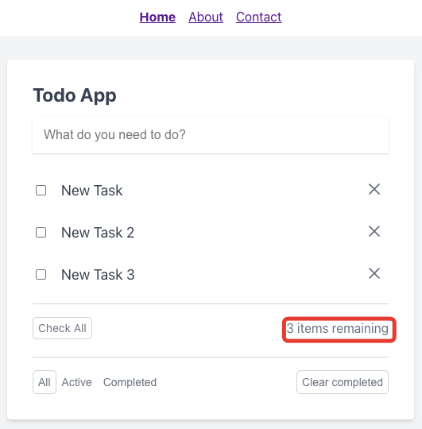

# Индикатор незавершенных задач

Под списком задач располагается индикатор общего количества незавершенных задач:

При завершении задач значение индикатора уменьшается:

---

Следующее: [Завершение всех задач](../09-complete-all-tasks/README.md)