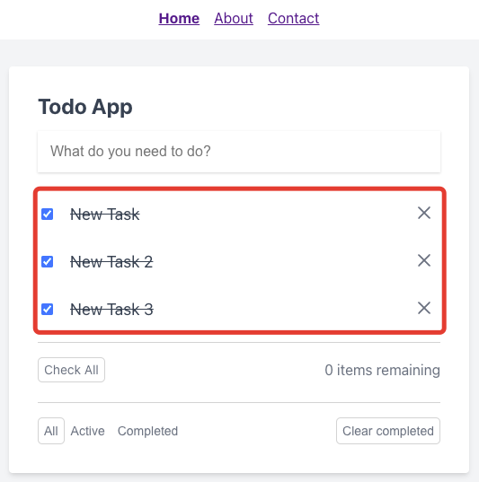

# Завершение всех задач

Под списком задач располагается кнопка завершения всех задач:

После её нажатия все задачи становятся завершенными:

---

Следующее: [Фильтрация задач](../10-filter-tasks/README.md)