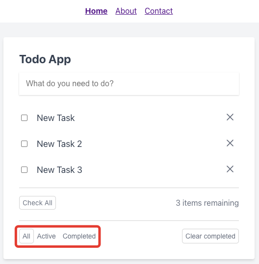
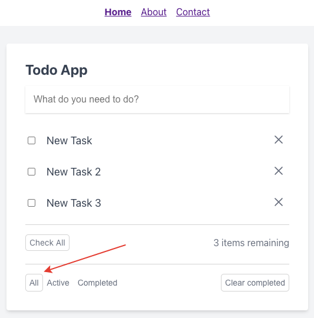
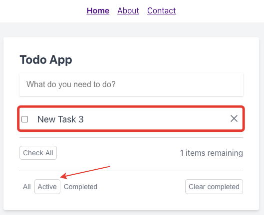
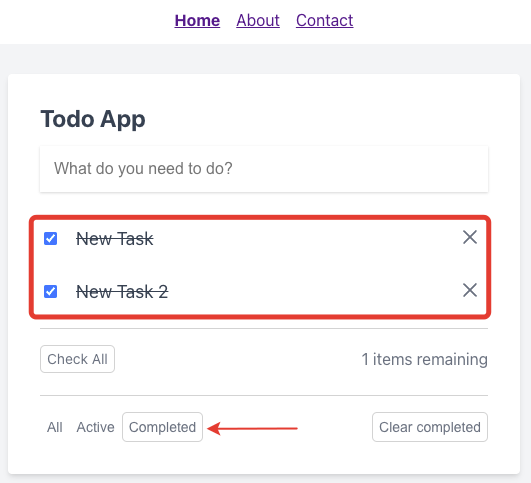

# Фильтрация задач

Под списком задач располагаются кнопки фильтрации:

По-умолчанию отображаются все задачи:

Также можно отобразить только незавершенные задачи:

Или только завершенные:

---

Следующее: [Очистка завершенных задач](../11-clear-completed-tasks/README.md)