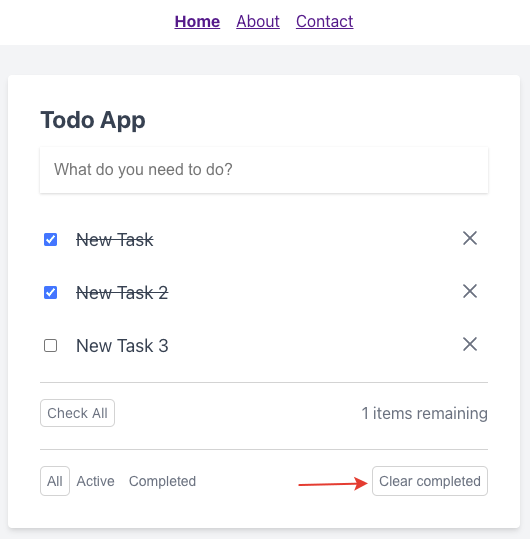

# Фильтрация задач

Под списком задач располагаются кнопки очистки завершенных задач:

После её нажатия все завершенные задачи удаляются из списка.

---

Следующее: [Страница "О приложении"](../11-page-about/README.md)